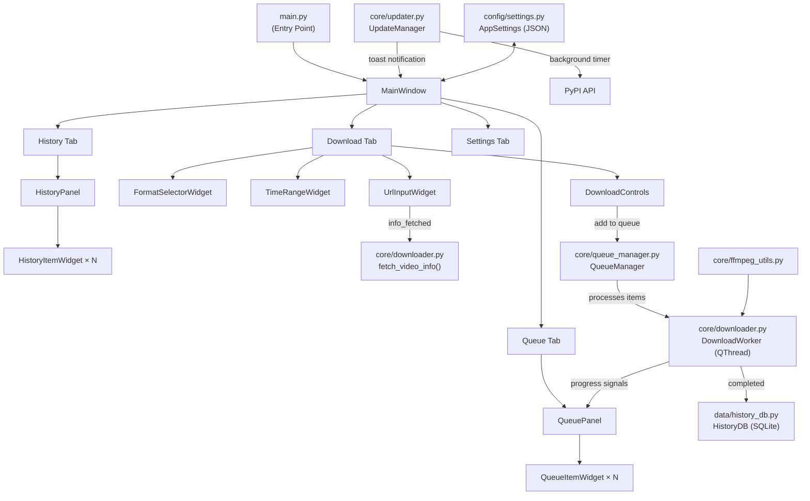
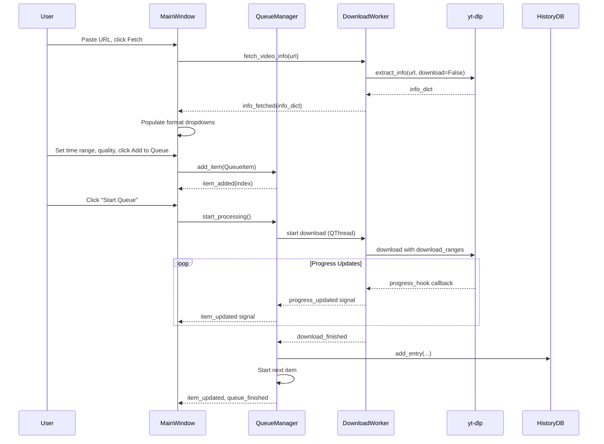

# YouCut — YouTube Video/Audio Clipper & Downloader

A Python + PySide6 desktop application that downloads and clips YouTube videos with a queue system, download history, and auto-updating yt-dlp backend.

## User Review Required

> [!IMPORTANT]
> **FFmpeg bundling**: The spec calls for bundling `ffmpeg.exe` inside `assets/`. I will create the folder structure and reference it in the build spec, but you'll need to **manually place a static `ffmpeg.exe`** binary into `clipgrab/assets/` before building (it's ~140MB and cannot be generated). I'll add instructions in the README for where to download it (gyan.dev or BtbN GitHub releases).

> [!IMPORTANT]
> **pyqtdarktheme**: The spec asks for dark/light theme toggle. I'll use the `pyqtdarktheme` library which provides polished Qt dark/light stylesheets with one-line setup — much better than hand-writing QSS. If you'd prefer hand-rolled QSS instead, let me know.

> [!WARNING]
> **Single-file PyInstaller .exe**: Bundling ffmpeg.exe (~140MB) into a single-file .exe will make the final executable very large (~180–200MB) and slow to start (it extracts to a temp dir on each launch). A **one-folder** build would be much faster. I'll create the spec for single-file as requested, but note this trade-off.

## Open Questions

1. **Concurrent downloads**: The spec says "sequential by default" — should I include a settings toggle for parallel downloads (2–3 concurrent), or keep it strictly sequential for v1?
2. **Thumbnail caching**: Queue items should show thumbnails. Should I download and cache them locally, or just load them from URL each time?
3. **Audio conversion codecs**: For "Audio only" mode, the spec mentions mp3/m4a/wav output. Should I default to mp3, or let the user pick from a dropdown of all three?

## Proposed Changes

The entire project is new. I'll build it in the following component order, matching the spec's incremental approach.

---

### Phase 1: Project Skeleton & Core Logic

#### [NEW] [`requirements.txt`](file:///c:/Users/adysi/OneDrive/Documents/Code/Antigravity/Youtube%20specific%20clip%20downloader/clipgrab/requirements.txt)
Pinned dependencies:
```
yt-dlp==2024.12.23
PySide6==6.8.1
pyqtdarktheme==2.1.0
pyinstaller==6.11.1
```

#### [NEW] [`clipgrab/core/validator.py`](file:///c:/Users/adysi/OneDrive/Documents/Code/Antigravity/Youtube%20specific%20clip%20downloader/clipgrab/core/validator.py)
- `validate_youtube_url(url: str) -> tuple[bool, str]` — regex-based YouTube URL validation (handles youtube.com/watch, youtu.be, /shorts/, /live/, playlist URLs)
- `validate_time_range(start: str, end: str, duration: float) -> tuple[bool, str]` — HH:MM:SS parsing, start < end ≤ duration
- `parse_time_to_seconds(time_str: str) -> float` — converts HH:MM:SS to seconds
- `seconds_to_hms(seconds: float) -> str` — converts seconds back to HH:MM:SS
- `sanitize_filename(name: str) -> str` — strips illegal Windows characters

#### [NEW] [`clipgrab/core/formats.py`](file:///c:/Users/adysi/OneDrive/Documents/Code/Antigravity/Youtube%20specific%20clip%20downloader/clipgrab/core/formats.py)
- `parse_video_formats(info_dict: dict) -> list[VideoFormat]` — filters formats where `vcodec != 'none'`, extracts resolution, fps, codec, filesize_approx, format_id
- `parse_audio_formats(info_dict: dict) -> list[AudioFormat]` — filters formats where `acodec != 'none'` and `vcodec == 'none'`, extracts bitrate, codec, format_id
- `VideoFormat` / `AudioFormat` — typed dataclasses with `display_label()` method for dropdown text
- `detect_video_type(info_dict: dict) -> VideoType` — enum: SINGLE_VIDEO, PLAYLIST, LIVE_STREAM, AGE_RESTRICTED, UNAVAILABLE

#### [NEW] [`clipgrab/core/downloader.py`](file:///c:/Users/adysi/OneDrive/Documents/Code/Antigravity/Youtube%20specific%20clip%20downloader/clipgrab/core/downloader.py)
- `DownloadWorker(QObject)` — runs in QThread, emits signals:
  - `progress_updated(percent: float, speed: str, eta: str)`
  - `download_finished(output_path: str)`
  - `download_failed(error_msg: str, is_extraction_error: bool)`
  - `status_changed(status: str)`
- `fetch_video_info(url: str) -> dict` — calls `yt_dlp.YoutubeDL.extract_info(url, download=False)` with error classification
- Uses `download_ranges` via `download_range_func` from `yt_dlp.utils` for clipping
- Uses `progress_hooks` for real-time progress
- Points `ffmpeg_location` at bundled `ffmpeg.exe` (resolved via `get_ffmpeg_path()`)
- `_cancel_flag: bool` — checked in progress hook to raise abort
- Catches `DownloadError`, `ExtractorError` specifically, classifies errors for the auto-update trigger

#### [NEW] [`clipgrab/core/queue_manager.py`](file:///c:/Users/adysi/OneDrive/Documents/Code/Antigravity/Youtube%20specific%20clip%20downloader/clipgrab/core/queue_manager.py)
- `QueueItem` dataclass — url, title, thumbnail_url, start_time, end_time, video_format, audio_format, output_path, status (Pending/Downloading/Done/Failed/Cancelled), error_msg
- `QueueManager(QObject)` — manages list of QueueItems, emits signals:
  - `item_added(index)`, `item_removed(index)`, `item_updated(index)`, `queue_finished()`
  - `processing_started()`, `processing_stopped()`
- Sequential processing: starts next Pending item when current finishes
- `add_item()`, `remove_item()`, `reorder_item()`, `retry_item()`, `cancel_current()`, `cancel_all()`
- Thread-safe: uses QMutex for queue state access
- Owns the DownloadWorker thread lifecycle

#### [NEW] [`clipgrab/core/ffmpeg_utils.py`](file:///c:/Users/adysi/OneDrive/Documents/Code/Antigravity/Youtube%20specific%20clip%20downloader/clipgrab/core/ffmpeg_utils.py)
- `get_ffmpeg_path() -> str` — resolves path via `sys._MEIPASS` (frozen) or `assets/ffmpeg.exe` (dev)
- `verify_ffmpeg() -> tuple[bool, str]` — checks existence, runs `ffmpeg -version`, returns (ok, version_or_error)

#### [NEW] [`clipgrab/core/updater.py`](file:///c:/Users/adysi/OneDrive/Documents/Code/Antigravity/Youtube%20specific%20clip%20downloader/clipgrab/core/updater.py)
- `UpdateChecker(QObject)` — background worker for yt-dlp update checks:
  - `check_for_update() -> tuple[bool, str, str]` — compares `importlib.metadata.version('yt-dlp')` vs PyPI JSON API (`https://pypi.org/pypi/yt-dlp/json`)
  - `perform_update()` — runs `pip install -U yt-dlp` via subprocess
  - Signals: `update_available(current: str, latest: str)`, `update_completed(new_version: str)`, `update_failed(error: str)`
- `UpdateManager` — orchestrates check timing:
  - On launch: check if last-checked > 1 hour ago (reads from config)
  - Idle timer: QTimer fires after 30 min idle, triggers re-check
  - Error-triggered: immediate check when extraction error detected
  - Never auto-updates during active downloads (checks queue state)
  - Respects `auto_update_ytdlp` setting from config

---

### Phase 2: Data Layer

#### [NEW] [`clipgrab/data/history_db.py`](file:///c:/Users/adysi/OneDrive/Documents/Code/Antigravity/Youtube%20specific%20clip%20downloader/clipgrab/data/history_db.py)
- SQLite database at `~/.clipgrab/history.db`
- Schema:
  ```sql
  CREATE TABLE downloads (
      id INTEGER PRIMARY KEY AUTOINCREMENT,
      title TEXT NOT NULL,
      url TEXT NOT NULL,
      start_time TEXT,
      end_time TEXT,
      video_quality TEXT,
      audio_quality TEXT,
      output_path TEXT NOT NULL,
      file_size INTEGER,
      downloaded_at TIMESTAMP DEFAULT CURRENT_TIMESTAMP,
      thumbnail_url TEXT
  );
  ```
- `HistoryDB` class: `add_entry()`, `get_all()`, `search(query)`, `filter_by_date(start, end)`, `delete_entry(id)`, `get_entry(id)`, `file_exists(id) -> bool`

#### [NEW] [`clipgrab/config/settings.py`](file:///c:/Users/adysi/OneDrive/Documents/Code/Antigravity/Youtube%20specific%20clip%20downloader/clipgrab/config/settings.py)
- JSON config at `~/.clipgrab/config.json`
- `AppSettings` class with typed properties:
  - `last_output_folder: str`
  - `theme: str` ("dark" | "light")
  - `auto_update_ytdlp: bool` (default True)
  - `last_update_check: str` (ISO timestamp)
  - `last_ytdlp_version: str`
  - `window_geometry: dict` (x, y, width, height)
- `load()` / `save()` with file locking and defaults

---

### Phase 3: GUI — Main Window & Single Download Flow

#### [NEW] [`clipgrab/main.py`](file:///c:/Users/adysi/OneDrive/Documents/Code/Antigravity/Youtube%20specific%20clip%20downloader/clipgrab/main.py)
- Entry point: creates QApplication, sets up logging (rotating file + console), applies theme, launches MainWindow
- Clipboard auto-detect on startup: if clipboard contains YouTube URL, offer to prefill

#### [NEW] [`clipgrab/gui/main_window.py`](file:///c:/Users/adysi/OneDrive/Documents/Code/Antigravity/Youtube%20specific%20clip%20downloader/clipgrab/gui/main_window.py)
- `MainWindow(QMainWindow)` with tab-based layout:
  - **Download Tab**: URL input, Fetch Info, format selectors, time inputs, filename, output folder, Add to Queue / Download Now buttons
  - **Queue Tab**: queue list with per-item controls
  - **History Tab**: searchable history list
  - **Settings Tab**: theme toggle, auto-update toggle, output folder default, manual update check button
- Status bar: shows current operation, yt-dlp version, ffmpeg status
- Toast notification system for non-blocking messages (yt-dlp updates, etc.)

#### [NEW] [`clipgrab/gui/widgets/url_input.py`](file:///c:/Users/adysi/OneDrive/Documents/Code/Antigravity/Youtube%20specific%20clip%20downloader/clipgrab/gui/widgets/url_input.py)
- `UrlInputWidget(QWidget)` — text field + Fetch Info button + validation indicator
- Emits `info_fetched(info_dict)` signal on successful fetch
- Shows spinner during fetch, error message on failure with classified error type

#### [NEW] [`clipgrab/gui/widgets/format_selector.py`](file:///c:/Users/adysi/OneDrive/Documents/Code/Antigravity/Youtube%20specific%20clip%20downloader/clipgrab/gui/widgets/format_selector.py)
- `FormatSelectorWidget(QWidget)` — video quality dropdown, audio quality dropdown, audio-only toggle
- Populated from real format data after fetch
- "Best available" as default first item
- Audio-only mode: hides video dropdown, shows audio format selector (mp3/m4a/wav)

#### [NEW] [`clipgrab/gui/widgets/time_range_input.py`](file:///c:/Users/adysi/OneDrive/Documents/Code/Antigravity/Youtube%20specific%20clip%20downloader/clipgrab/gui/widgets/time_range_input.py)
- `TimeRangeWidget(QWidget)` — start/end time inputs with HH:MM:SS input masks
- Duration mode toggle (end time = start + duration)
- Shows total video duration label
- Real-time validation: start < end ≤ duration
- "Full video" checkbox that disables time inputs

#### [NEW] [`clipgrab/gui/widgets/download_controls.py`](file:///c:/Users/adysi/OneDrive/Documents/Code/Antigravity/Youtube%20specific%20clip%20downloader/clipgrab/gui/widgets/download_controls.py)
- Filename input (auto-suggested from title + timecodes, editable)
- Output folder picker (remembers last used)
- "Add to Queue" button + "Download Now" button
- Progress bar + speed/ETA labels + Cancel button (visible during download)

---

### Phase 4: GUI — Queue & History Panels

#### [NEW] [`clipgrab/gui/widgets/queue_panel.py`](file:///c:/Users/adysi/OneDrive/Documents/Code/Antigravity/Youtube%20specific%20clip%20downloader/clipgrab/gui/widgets/queue_panel.py)
- `QueuePanel(QWidget)` — list view of QueueItems
- Each item shows: thumbnail, title, time range, quality, status badge (color-coded)
- Controls: Start Queue, Pause Queue, Clear Completed
- Per-item: drag to reorder (before processing), remove, retry (if failed), cancel (if pending)
- Updates in real-time as downloads progress

#### [NEW] [`clipgrab/gui/widgets/queue_item_widget.py`](file:///c:/Users/adysi/OneDrive/Documents/Code/Antigravity/Youtube%20specific%20clip%20downloader/clipgrab/gui/widgets/queue_item_widget.py)
- `QueueItemWidget(QFrame)` — individual queue item card
- Thumbnail (loaded async from URL), title, timecodes, quality label, status badge, action buttons
- Progress bar shown when status == Downloading

#### [NEW] [`clipgrab/gui/widgets/history_panel.py`](file:///c:/Users/adysi/OneDrive/Documents/Code/Antigravity/Youtube%20specific%20clip%20downloader/clipgrab/gui/widgets/history_panel.py)
- `HistoryPanel(QWidget)` — search bar + filterable list of past downloads
- Search by title, filter by date range
- Each row: title, date, timecodes, quality, file size
- Per-entry actions: "Open file location" (opens Explorer to file), "Re-download" (re-queues), "Remove from history"
- "File not found" indicator if file was moved/deleted

#### [NEW] [`clipgrab/gui/widgets/history_item_widget.py`](file:///c:/Users/adysi/OneDrive/Documents/Code/Antigravity/Youtube%20specific%20clip%20downloader/clipgrab/gui/widgets/history_item_widget.py)
- `HistoryItemWidget(QFrame)` — individual history row
- Shows file-exists status, action buttons

#### [NEW] [`clipgrab/gui/widgets/settings_panel.py`](file:///c:/Users/adysi/OneDrive/Documents/Code/Antigravity/Youtube%20specific%20clip%20downloader/clipgrab/gui/widgets/settings_panel.py)
- Theme toggle (dark/light)
- Auto-update yt-dlp toggle
- Default output folder
- "Check for yt-dlp updates now" button
- Current versions display (yt-dlp, ffmpeg, app)

#### [NEW] [`clipgrab/gui/widgets/toast_notification.py`](file:///c:/Users/adysi/OneDrive/Documents/Code/Antigravity/Youtube%20specific%20clip%20downloader/clipgrab/gui/widgets/toast_notification.py)
- `ToastNotification(QWidget)` — slide-in/fade notification for non-blocking messages
- Auto-dismisses after 5 seconds, can be manually dismissed
- Used for: update notifications, download completion, errors

---

### Phase 5: Polish & Packaging

#### [NEW] [`clipgrab/gui/theme.py`](file:///c:/Users/adysi/OneDrive/Documents/Code/Antigravity/Youtube%20specific%20clip%20downloader/clipgrab/gui/theme.py)
- `apply_theme(app, theme_name)` — wraps `qdarktheme.setup_theme()`
- `toggle_theme(app, settings)` — switches and persists

#### [NEW] [`clipgrab/core/logger.py`](file:///c:/Users/adysi/OneDrive/Documents/Code/Antigravity/Youtube%20specific%20clip%20downloader/clipgrab/core/logger.py)
- Rotating file handler (5MB, 3 backups) at `~/.clipgrab/clipgrab.log`
- Console handler for dev mode
- Structured format: `[TIMESTAMP] [LEVEL] [MODULE] message`

#### [NEW] [`clipgrab/assets/icons/`](file:///c:/Users/adysi/OneDrive/Documents/Code/Antigravity/Youtube%20specific%20clip%20downloader/clipgrab/assets/icons/)
- App icon, status icons (pending, downloading, done, failed, cancelled)
- Placeholder for ffmpeg.exe

#### [NEW] [`build.spec`](file:///c:/Users/adysi/OneDrive/Documents/Code/Antigravity/Youtube%20specific%20clip%20downloader/clipgrab/build.spec)
- PyInstaller spec file:
  - `Analysis(['main.py'], ...)`
  - `binaries=[('assets/ffmpeg.exe', '.')]`
  - `datas=[('assets/icons', 'assets/icons')]`
  - Single-file mode (`onefile=True`)
  - Windows console hidden

#### [NEW] [`README.md`](file:///c:/Users/adysi/OneDrive/Documents/Code/Antigravity/Youtube%20specific%20clip%20downloader/README.md)
- Setup instructions (Python 3.11+, pip install -r requirements.txt)
- How to get ffmpeg.exe and place it in assets/
- How to run from source (`python main.py`)
- How to build with PyInstaller (`pyinstaller build.spec`)
- Known limitations

---

## Architecture Diagram



## Signal Flow for Key Operations



## Verification Plan

### Automated Tests
- I'll create a CLI test script (`test_core.py`) that validates:
  - URL validation (valid/invalid URLs)
  - Time range parsing and validation
  - Format parsing from a sample info_dict
  - Filename sanitization
  - Settings load/save roundtrip
  - History DB CRUD operations

### Manual Verification
1. **Phase 1**: Run the CLI test script to verify all core logic
2. **Phase 3**: Launch the GUI, fetch a real YouTube video, verify format dropdowns populate correctly, download a clip
3. **Phase 4**: Add multiple items to queue, verify sequential processing, check history panel populates
4. **Phase 5**: Build with PyInstaller, test on the current machine, verify ffmpeg detection works
5. **End-to-end**: Download a 30-second clip from a public YouTube video, verify the output file plays correctly
